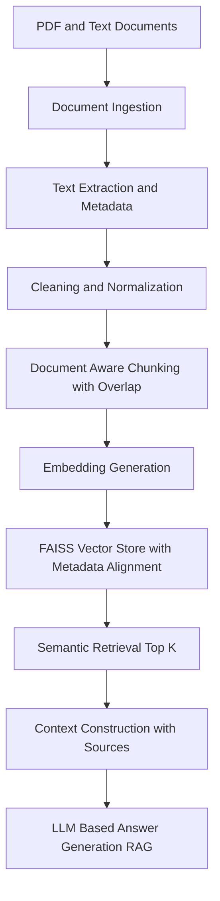

# Multi-Modal Document ETL & Retrieval-Augmented Generation (RAG) System

This project implements a multi-modal document ETL and Retrieval-Augmented Generation (RAG) pipeline that ingests PDF and text documents, extracts page-aware text and metadata, performs document-aware chunking, and enables semantic retrieval with source attribution using a vector database.

The system is designed to mirror real-world enterprise and research workflows, where document structure, traceability, and explainability are critical.

## Architecture



## Key Features
- Multi-modal ingestion (PDF + text)
- Page-level text extraction from PDFs
- Preservation of document and page metadata
- Document-aware chunking with overlap
- Semantic embeddings using SentenceTransformers
- FAISS-based vector search
- Metadata-aware retrieval with source attribution
- Modular, debuggable, and extensible design

## Tech Stack
- **Language**: Python
- **Document Parsing**: pdfplumber
- **Embeddings**: SentenceTransformers
- **Vector Database**: FAISS
- **LLM Integration**: OpenAI API (RAG-ready)

## How It Works (High Level)
1. Ingests PDF and text documents
2. Extracts text with page-level metadata
3. Cleans and normalizes content
4. Chunks documents while preserving source context
5. Generates semantic embeddings
6. Stores vectors in FAISS with aligned metadata
7. Retrieves relevant chunks for a query
8. Builds grounded context for RAG responses

## How to Run
```
pip install -r requirements.txt
python main.py
```
Ask a question interactively to retrieve relevant document content with source information.

## Example Output
```
[source: sample.pdf | page: 3]
Deep learning uses neural networks with multiple layers...
```

## Future Enhancements
- OCR support for scanned PDFs
- ANN indexing (IVF/HNSW) for large datasets
- Metadata filtering and ranking
- Multi-document and domain-specific pipelines

## Author
Sapthasree N K
